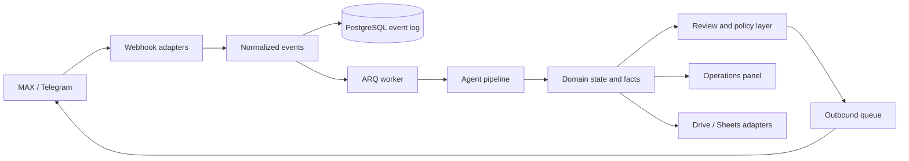

# Commandex Business Assistant

> A production-oriented multi-agent backend for operational teams: it turns incoming conversations and documents into structured events, controlled decisions, and auditable workflows.

This repository is a **portfolio edition** of a larger private implementation. It contains no credentials, customer records, real addresses, personal conversations, or production tokens. External channels and cloud storage remain disabled unless explicitly configured by the operator.

## What this project demonstrates

The system unifies messages from multiple channels, normalizes them into a common event model, resolves entities, extracts structured facts with an LLM, stores an auditable history, and routes safe outbound actions through policy checks and human review.

| Capability | Implementation focus |
|---|---|
| Event-driven ingestion | Webhook authentication, normalization, deduplication, persistence, and asynchronous processing. |
| Multi-agent workflow | Specialized agents for extraction, object state, documents, reports, payments, and communication. |
| Controlled automation | Outbound policy, approval workflow, pause switch, first-contact protection, and idempotency keys. |
| Integrations | MAX, Telegram, PostgreSQL, Redis/ARQ, Google Drive, Google Sheets, and LLM providers. |
| Operations panel | Authenticated server-rendered UI for review queues, objects, people, knowledge, payments, and health. |
| Privacy by design | Environment-based secrets, least-privilege cloud scopes, pseudonymization utilities, and no bundled production data. |

## Architecture



The channel layer is intentionally thin. Once an update is normalized, the rest of the system works with domain events rather than platform-specific payloads. Outbound messages never go directly from an LLM call to a customer: they pass through policy, optional human approval, a pause switch, and a final state check.

## Portfolio demo

The [`demo/`](demo/) directory contains synthetic payloads and a walkthrough for presenting the system without connecting real accounts. It uses fictional objects and names and is safe to show in a code review or interview.

The project is presented as a backend and operations workflow rather than a fake chat screenshot. The key engineering decisions are visible in the event model, idempotency rules, approval boundaries, integration adapters, and tests.

## Quick start

Requirements are Python 3.12+, Docker Compose, PostgreSQL 16 with pgvector, and Redis 7. Copy `.env.example` to `.env`, fill only the providers you want to enable, then run:

```bash
make install
make test
make lint
docker compose up -d --build
```

The development setup does not register external webhooks by default. Production credentials, cloud tokens, and customer-specific deployment settings must remain outside the repository.

## Quality signals

The portfolio snapshot was checked with a full automated test suite containing **754 passing tests** and a clean Ruff lint run. The tests cover event normalization, deduplication, agent routing, document handling, outbound policy, web authentication, payment logic, integration clients, and review flows.

## Repository map

| Path | Purpose |
|---|---|
| `src/repairbot/domain` | Domain events, facts, payments, and core value objects. |
| `src/repairbot/agents` | Agent pipeline and business workflows. |
| `src/repairbot/channels` | Channel adapters and platform normalization. |
| `src/repairbot/outbound` | Approval, policy, queue, and delivery controls. |
| `src/repairbot/web` | Authenticated operations panel, templates, and static as| `s. |
| `src/repair|ot/integrations` | LLM, Drive, Sheets, and external service clients. |
| `tests` | Unit and integration-style tests for application boundaries. |
| `demo` | Synthetic portfolio walkthrough and sample payloads. |

## Security and scope

Do not commit `.env`, `secrets/`, OAuth tokens, database volumes, customer exports, or real webhook URLs. This public edition is intended for architectural demonstration. A production deployment requires a separate secret store, backups, monitoring, rate limits, CSRF protection for administrative forms, and an operational runbook.

## License and usage

This repository is a portfolio presentation of engineering work. Before reusing it in production, review dependency licenses, the threat model, data-retention requirements, and the terms of each selected messaging platform.
