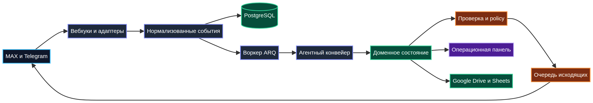

# Commandex Business Assistant

> Production-oriented мультиагентный backend для операционных команд: он превращает входящие сообщения и документы в структурированные события, контролируемые решения и проверяемые рабочие процессы.

Этот репозиторий — **portfolio-версия** более крупной закрытой реализации. В нём нет учётных данных, клиентских записей, реальных адресов, личных переписок и production-токенов. Внешние каналы и облачное хранилище отключены, пока оператор явно не задаст необходимые настройки.

## Что демонстрирует проект

Система объединяет сообщения из нескольких каналов, приводит их к единой модели событий, разрешает сущности, извлекает структурированные факты с помощью LLM, сохраняет историю и направляет безопасные исходящие действия через политики и ручную проверку.

| Возможность | Что реализовано |
|---|---|
| Событийный ingestion | Аутентификация вебхуков, нормализация, дедупликация, сохранение и асинхронная обработка. |
| Мультиагентный workflow | Специализированные агенты для извлечения фактов, состояния объекта, документов, отчётов, платежей и коммуникации. |
| Контролируемая автоматизация | Политика исходящих сообщений, согласование, пауза диалога, защита первого контакта и ключи идемпотентности. |
| Интеграции | MAX, Telegram, PostgreSQL, Redis/ARQ, Google Drive, Google Sheets и LLM-провайдеры. |
| Операционная панель | Авторизованный server-rendered интерфейс для очередей проверки, объектов, людей, знаний, платежей и состояния системы. |
| Privacy by design | Секреты через окружение, минимальные права облачных интеграций, псевдонимизация и отсутствие production-данных в репозитории. |

## Архитектура



Слой каналов намеренно остаётся тонким. После нормализации остальная система работает с доменными событиями, а не со специфичными payload платформы. Исходящее сообщение никогда не отправляется напрямую из LLM-вызова: оно проходит через policy, при необходимости ручное согласование, паузу и финальную проверку состояния.

## Демо для портфолио

В каталоге [`demo/`](demo/) находятся синтетический payload и сценарий показа системы без подключения реальных аккаунтов. Используются вымышленные объекты и имена, поэтому материалы подходят для code review и собеседования.

Проект демонстрируется как backend и операционный workflow, а не как имитация переписки на скриншотах. Основные инженерные решения видны в модели событий, правилах идемпотентности, границах согласования, адаптерах интеграций и тестах.

## Быстрый запуск

Требуются Python 3.12+, Docker Compose, PostgreSQL 16 с pgvector и Redis 7. Скопируйте `.env.example` в `.env`, укажите только нужные провайдеры и выполните:

```bash
make install
make test
make lint
docker compose up -d --build
```

В development-режиме внешние вебхуки по умолчанию не регистрируются. Production-учётные данные, облачные токены и настройки конкретного заказчика должны храниться вне репозитория.

## Результаты проверок

Portfolio-снимок проверен полным набором из **754 успешно пройденных тестов** и чистым Ruff. Тесты охватывают нормализацию событий, дедупликацию, маршрутизацию агентов, обработку документов, policy исходящих сообщений, веб-аутентификацию, платежную логику, клиентов интеграций и процессы ревью.

## Структура репозитория

| Путь | Назначение |
|---|---|
| `src/repairbot/domain` | Доменные события, факты, платежи и базовые объекты. |
| `src/repairbot/agents` | Агентный конвейер и бизнес-workflow. |
| `src/repairbot/channels` | Адаптеры каналов и нормализация платформ. |
| `src/repairbot/outbound` | Согласование, policy, очередь и доставка сообщений. |
| `src/repairbot/web` | Операционная панель, шаблоны и статические ресурсы. |
| `src/repairbot/integrations` | Клиенты LLM, Drive, Sheets и внешних сервисов. |
| `tests` | Модульные и интеграционные тесты границ приложения. |
| `demo` | Синтетический сценарий показа и sample payload. |

## Безопасность и границы проекта

Не добавляйте в Git `.env`, `secrets/`, OAuth-токены, тома базы данных, выгрузки клиентов и реальные webhook URL. Эта публичная версия предназначена для демонстрации архитектуры. Production-развёртывание требует отдельного хранилища секретов, резервного копирования, мониторинга, rate limits, CSRF-защиты административных форм и операционного runbook.

## Лицензия и использование

Репозиторий представляет инженерную работу в формате портфолио. Перед использованием в production проверьте лицензии зависимостей, threat model, требования к хранению данных и условия выбранных мессенджеров.
